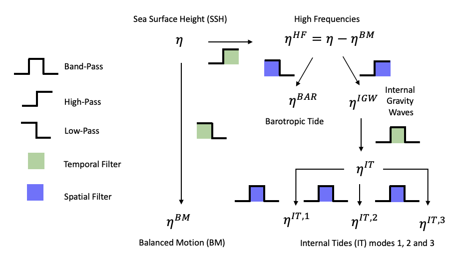

# MAPPING THE SURFACE MESOSCALE OCEAN DYNAMICS IN THE SOUTH-WEST TROPICAL PACIFIC OCEAN USING SWOT ALTIMETRY DATA

## Context

The SWOT mission will enhance ocean dynamics observation to sub-mesoscale signals (<50 km) with its wide-swath measurement capability, providing 2 km resolution SSH data. At these fine scales, Sea Surface Height (SSH) variations are driven by Balanced Motions (BM) and Internal Tide (IT), requiring separation of these influences for effective use. The MEOM team at IGE, in collaboration with Datlas, is developing a method to separate BM and IT using a data assimilation system. The South-West Tropical Pacific, especially around French New-Caledonia, is a key study area due to strong IT generation. 

More information: [Master 2 Internship - Spring 2024](https://github.com/vbellemin/2024-internship-caledo) 

The Intership report can be download here.

## Approach

In a nutshell, this intership project aims to develop an Observing System simulation Expeeriment (OSSE) for evaluating the effectiveness of Balanced Motion and Internal Tides reconstruction using spatially realistic Sea Surface Height (SSH) observations obtained by the SWOT and Nadir observations in the Southwestern Tropical Pacific around New Caledonia. In this regard, the strategies taken by this challenge reflect both the scientific aspirations and the practical challenges encountered on the way that include:

- Adjust High-Resolution SSH observations from CALEDO60 dataset by incorporating atmospheric influences, and quantify the reliability of this adjusted dataset.
- Generate a Nature Run observations using the CALEDO60 dataset to simulate realistic ocean conditions and separate the balanced and unbalanced motions (BM-UM) from the high-resolution SSH data.
- Extract the BM component from the adjusted CALEDO60 dataset using a temporal high-pass filter to isolate the barotropic tide.
- Extract the Internal Gravity Waves from the adjusted CALEDO60 dataset using a spectral band filter designed to target the specific wave frequency.

The work conducted so far has successfully led to the disentanglement of balanced and unbalanced motions through a series of sophisticated filtering techniques tailored to the CALEDO60 dataset. And adapting algorithms for coordinate interpolation, which had not been tested on this dataset before, posed significant challenges but is crucial for the implementation of the OSSE.

This steps follow the next scheme:

## What you will find in this branch of "OSSE_generator"

- **DAC**
  - An exploratory analysis of the data.
  - Removal of the Dynamic Atmospheric Correction (DAC) from the SSH component of CALEDO60.
  - Interpolation as both DAC and SSH data sets have different grids.
  - Variance and Covariance Analysis.
  - Loops for the animations.

- [**Exercises on CALEDO**](https://github.com/vbellemin/2024-internship-caledo/blob/main/Exercises_CALEDO.md)
  - 1D plotting
  - 2D plotting
  - Grid and Interpolation
  - Analysis
  - Animation

- **GEBCO**
  - Gradient plot for GEBCO's bathymetry.
- **filter_tool**
- **Images**
  - Images for the README file
- **interp_satellite_track**
- **requierements.ipynb**
  - This file contains the libraries used across the all notebooks.

